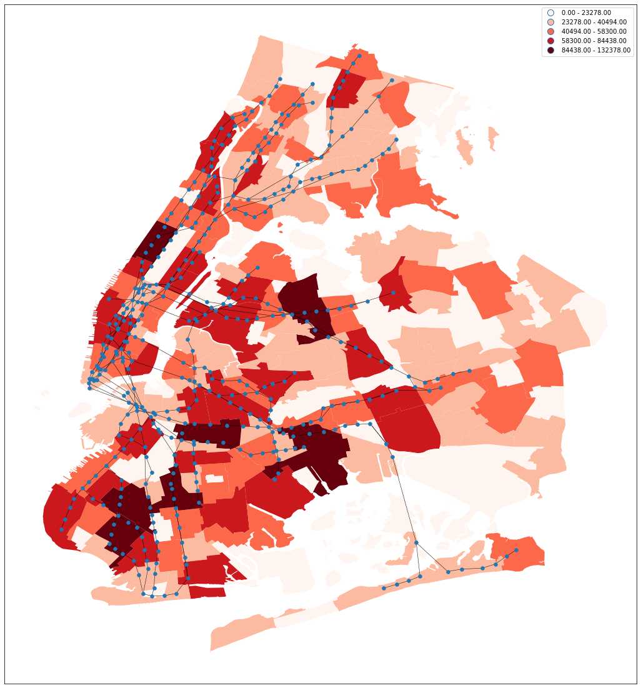
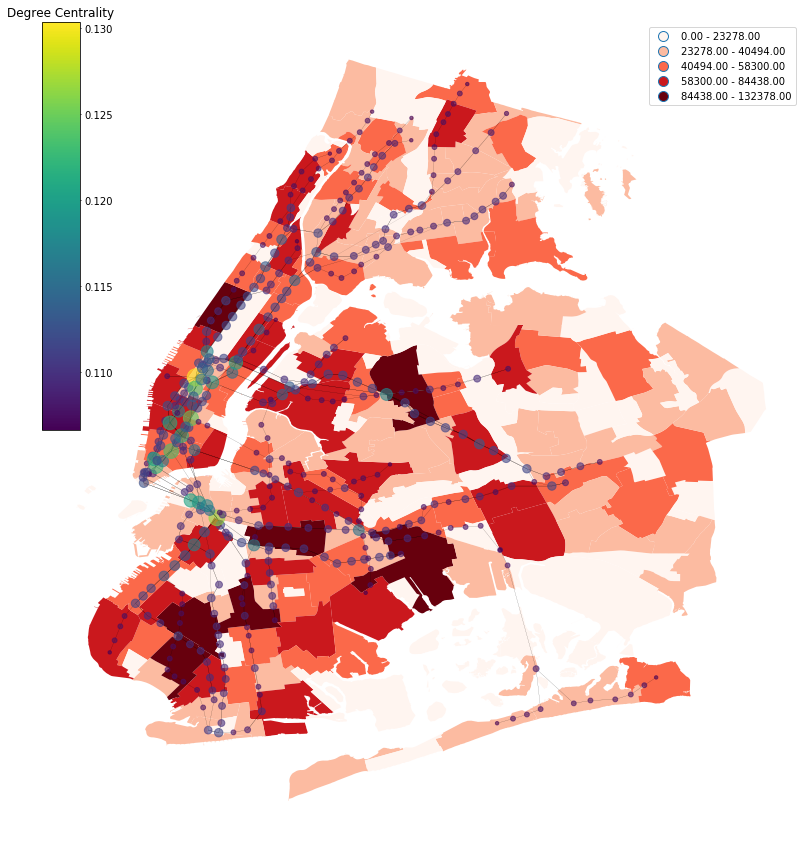
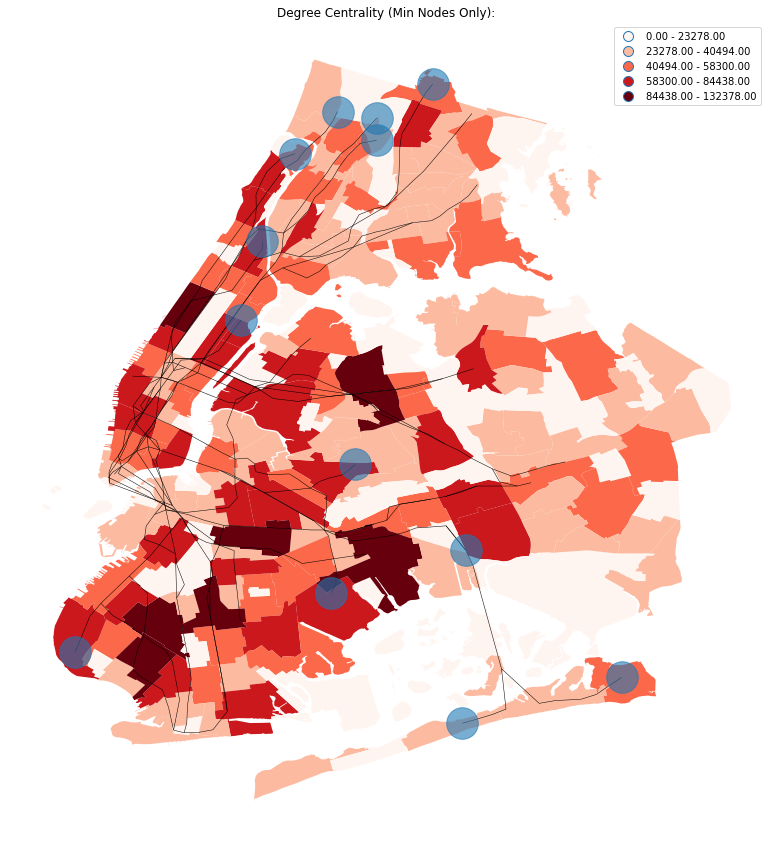
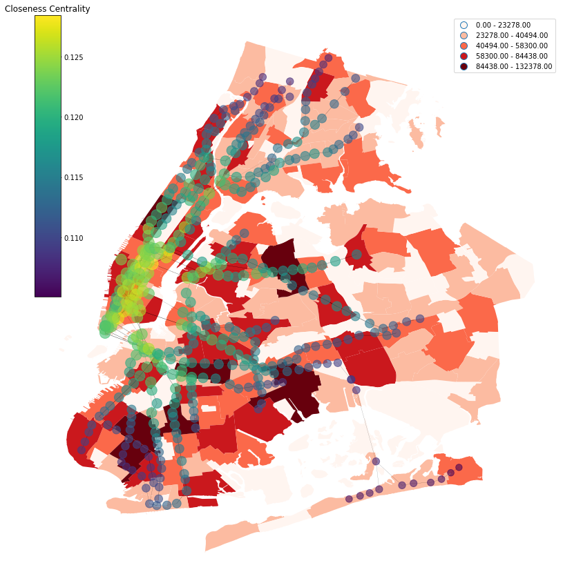
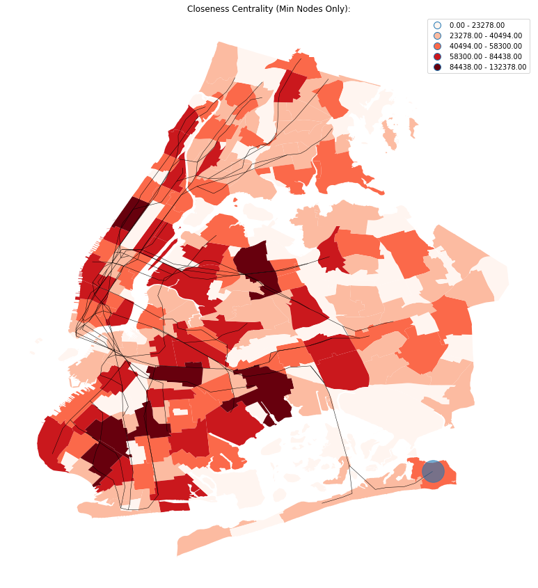
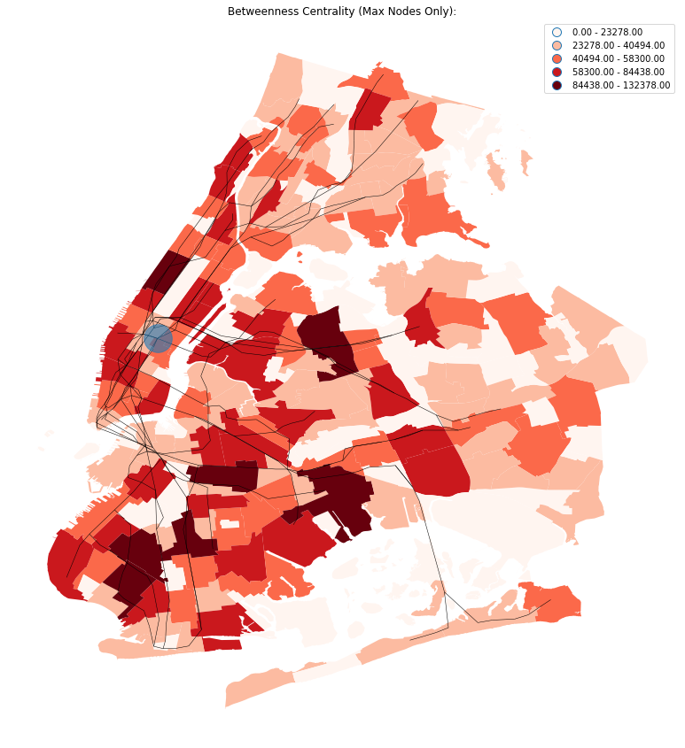
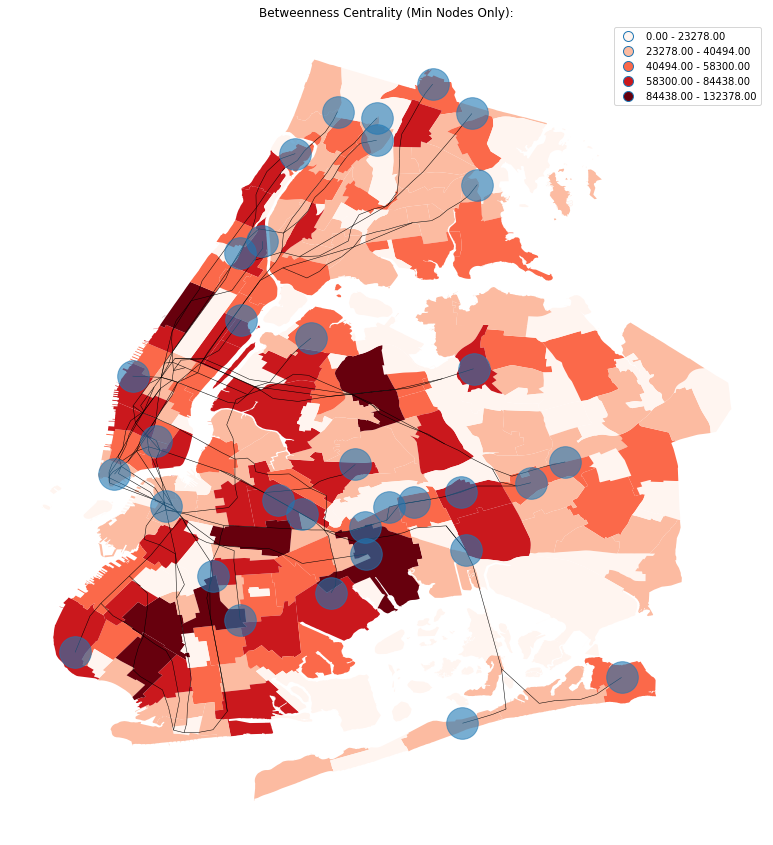

# Estimating New York City&#39;s Population through Network Manipulations of the Subway System

B., Jordan &amp; Didwania, Aneesh

**Abstract**

Below, we analyze conclusions from Louf et Al.&#39;s _Scaling in Transportation Networks_[1](https://journals.plos.org/plosone/article/file?type=printable&amp;id=10.1371/journal.pone.0102007) regarding the prediction of population densities from transit networks, specifically in the New York City Subway System. We show that nodes based on high centrality measurements in the Subway System do not necessarily correspond to areas with high population densities because of New York City&#39;s geography and its commuter population. However, general areas which are closer towards the center of the network, are denser than areas at the outskirts of the network.

**Introduction**

Urban train systems are used by millions of people all over the world every day. They are essential to a city&#39;s infrastructure and its transportation network. They provide easy access for people to go from one area to another at reduced costs and generally lie in densely populated cities where it is difficult and time-consuming to travel in cars. New York City&#39;s Subway System is no different. In NYC, roughly 5.7 million people (out of the 8.4 million residents) utilize the train system daily to go to work, school, and explore the city. In this paper, we explore the NYC Subway System stations in relevance to population density in select neighborhoods.

Our motivation for the paper stems from Louf et Al.&#39;s &quot;Scaling in Transportation Networks&quot;[1](https://journals.plos.org/plosone/article/file?type=printable&amp;id=10.1371/journal.pone.0102007), where the authors claim that a city&#39;s area, population and wealth density can be used to predict subway systems&#39; stations, networks, and its total ridership. The authors attempt to show this through the analysis of about 190 subway and railway networks across the world in relevance to historical and developmental comparisons. The paper shows that these networks are created because of economic mechanisms among other cultural and historical considerations. They conclusively prove that a cities&#39; demographic can give a rough estimate of the size and use of its transportation system.

Our paper comes from the linkage between the population and its relation to the Subway stations. We seek to explore the relationship between the use of a particular station and the population of the surrounding neighborhood from those stations. To do this we used Degree Centrality, Closeness Centrality, and Betweenness Centrality to measure what areas contain stations with the highest and lowest measures of these features and give plausible explanations for these results. In addition, we explore how the data looks overlaid with NYC&#39;s population densities to see how the network condenses its stations and links with higher populations.

**Data Source and Cleaning**

The data used to generate our analysis comes from the MTA (Metropolitan Transit Authority)[2](http://web.mta.info/developers/developer-data-terms.html#data) and New York City&#39;s Open Data Server[3](https://data.cityofnewyork.us/City-Government/New-York-City-Population-By-Neighborhood-Tabulatio/swpk-hqdp/data)[4](https://data.cityofnewyork.us/City-Government/Neighborhood-Tabulation-Areas-NTA-/cpf4-rkhq). The former came in the form of GTFS Data and required much cleaning to get the links and nodes to determine centralities. In their list of stations, they do not include station linkages (when two stations are connected without an individual having to exit the station in order to go to the other). Station linkages are integral to measure centralities as commuters can use them to shorten their route. To get the station linkages, we manually cleaned the data as many stations that were linked had different names and there was no clear dictionary or mapping feature to fix the data by code. The Open Data Server provided us with data regarding population densities in New York by NTA (Neighborhood Tabulation Areas) and their geographic regions across New York City. We plotted this underneath the subway network to visualize how the network related to population density.

**Preliminary Network Properties**

In our analysis of the network, our nodes represent the 425 Subway stations across NYC and our edges/links represent the 1834 connections all subway stations have with one another in total. There are not 1834 different subway tracks in the city that connect the various stations, however, this number was deduced through the number of unique possible connections that each particular subway line can make on a Weekday. We felt that this was a more accurate representation of the use of the network as simple connections based on train tracks would not actually show how the train system was being utilized. Moreover, each train line is independent of the others and operates under different circumstances and schedules thus grouping them by sheer linkage does not show the complexity of the data.

As a result of the station connections being unique to the train lines, the network is unweighted. Furthermore, it is not directed either because each train track comes in parallel with another going the opposite direction so a linkage can be used for a train going to and from a station. This network does not have a small-world property as the subway system network is tree-like in that there are many stations on different branches that will only meet after a long number of traversals across the network.

**Dataset Interests and Limitations**

The dataset is interesting because unlike other train network datasets, the NYC system is very comprehensive and easy to understand as all the train lines have unique paths and for a fixed fare of $2.75 you can go anywhere in the city. Because of the flat fare, the system is not bounded by economic limitations as in other systems where you need to have a certain amount of money to be able to go to some places.

We did want to explore the data in regards to wealth and how that relates to the transportation network, however, the New York data corresponding to this is not easily accessible from the American Community Survey of the New York City Department of City Planning as that gives the household income for each dataset. However, the Median Household Data Graph is shown in a figure below for reference (Figure 1). Furthermore, NYC uses several busses as well as methods of transportations in the greater area, but we did not explore this.

Figure 1

**Analysis**

In our Analysis we looked at Degree Centrality, Closeness Centrality, and Betweenness Centrality in relevance to population density of the surrounding area. Figure 2 shows the entire network plotted over the population densities.

Figure 2

**Degree Centrality**

Degree Centrality in a network measures the number of individual connections a node has to another node. Figure 3 shows the distribution of degree centralities over the population densities in NYC. As evident by the graph below, high population densities do not necessarily correspond to the highest degree centrality values. In this network the station with the highest Degree Centrality is Times Square 42nd St / Port Authority - 42nd St (Figure 4). This is a combination of two stations linked by a free transfer and is located at the heart of New York City. This station has the highest Degree Centrality as 12 major train lines run through it. Stations with the lowest values of Degree Centrality include Bay Ridge - 95 St, Woodlawn, Harlem - 148 St, and 96 St (Figure 5). These stations are located at the edges of the transit network and have only a single train line stem from it.

As seen below, the distribution of the degree centralities does not match areas with high population densities. This is attributed to the fact that many people work in areas that are well connected as they are the easiest to get to and tend to have the tallest buildings hosting a great deal of office spaces. The darker areas in the graph generally have nodes with smaller degree centralities because many people tend to commute from these areas to work via the few train lines there.

Figure 3

Figure 4

Figure 5

**Closeness Centrality**

Closeness Centrality in a network measures the sum of shortest paths that pass through the node. Figure 6 shows the distribution of closeness centralities over the population densities over NYC. As evident by the graph below, high population densities do not necessarily correspond to the highest closeness centrality values. In this network the station with the highest Closeness Centrality is Union Sq. - 14 St (Figure 7) with 8 major train lines running through it. This station is in an area with many businesses and residents. The station with the lowest value of Closeness Centrality is Far Rockaway - Mott Ave (Figure 8). This station is located the edge of New York City and is quite infrequently used

As seen below, the distribution of the closeness centralities does not match areas with high population densities. The areas with higher closeness centralities are near the center of Manhattan because it is very easy to transfer trains over there as all train lines but one (G Train) pass through it. From this, we can also see how the darker areas do not really have much difference in terms of node color compared to others in the outskirts.

Figure 6

Figure 7

Figure 8

**Betweenness Centrality**

Betweenness Centrality in a network measures the number of times a node falls on the shortest path between other nodes. Figure 9 shows the distribution of betweenness centralities over the population densities over NYC. As evident by the graph below, high population densities do not necessarily correspond to the highest betweenness centrality values. In this network the station with the highest Betweenness Centrality is Grand Central - 42nd St (Figure 10) with 5 major train lines running through it. This station like Times Square is in the center of the city. The stations with the lowest values of Betweenness Centrality include Jamaica - 179 St, Bay Ridge - 95 St, and 34 St - Hudson Yards (Figure 11). These stations are located at the corner of the train lines and only one line runs through it.

As seen below, the distribution of the betweenness centralities do not match areas with high population densities. The areas with higher betweenness centralities are in clusters all over the city but are typically around a dense concentration of nodes. And as with the other centralities, areas with low betweenness centralities are less densely populated likely because of people using the single lines there to get into the city for transfers.

Figure 9

Figure 10

Figure 11

**Conclusions**

Our analysis above shows that high population densities do not directly compare to stations with high values of Degree Centrality, Closeness Centrality, and Betweenness Centrality. This is attributed to the fact that in New York City, many people from various socio-economic backgrounds all work in similar areas. In a three-block radius alone, you can find construction departments, to small bars/restaurants, to Michelin Star Restaurants to high-rise office buildings. Although New Yorkers with differing socio-economic statuses live in different areas and work close to another, the majority use the subway system to get around as it is one of the most convenient and reliable methods of travel. As a result, it is difficult to use centrality measures or networks for that matter to get estimates of population and wealthy areas. This does not necessarily refute claims made by Louf et Al., who say that networks can be used to estimate such parameters. They are however correct in saying that areas with subway systems have higher population than those without. The edges across the population graph show this to be true. This is like many other cities as that is the border of the city, but NYC does have a significantly higher portion of individuals living in or near the center of the city Thus, our paper displays that no conclusive predictions or estimates can be drawn of New York City&#39;s population based on the centrality measurements of the Subway System.
